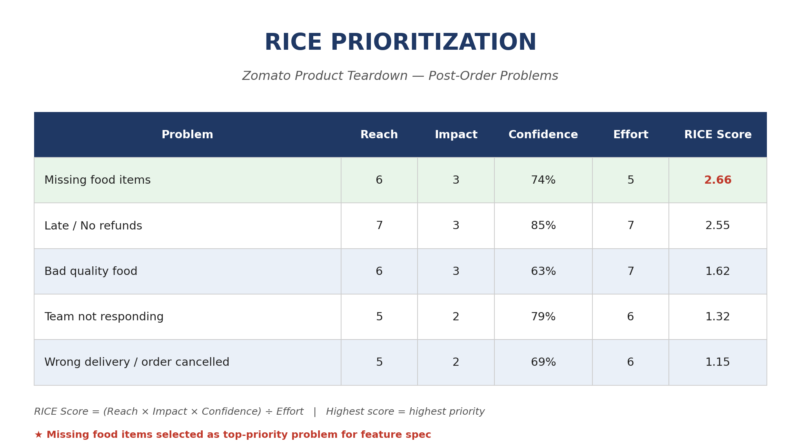

# Sudesh Singh — Quant & Product Projects

## Product Teardown & Feature Prioritization — Zomato Case Study

Full write-up: [Zomato_Case_Study_OnePager.pdf](Zomato_Case_Study_OnePager.pdf)

---

## Quant Projects
- `ma_crossover_backtest.py` — Moving-average crossover backtesting system
- `black_scholes_pricer.py` — Black-Scholes option pricer & Greeks calculator
## Store Operations Audit Framework — Quick-Commerce Case Study

A weighted audit scorecard across 5 categories — Inventory Accuracy, Hygiene & Cleanliness, Order Fulfillment SLA, Staff SOP Compliance, and Safety & Equipment — applied across 6 stores in Mumbai, with automatic status flagging (Good / Needs Improvement / Critical) and a dashboard summarizing store-wise and category-wise performance.

### Results Summary

| Store | Weighted Score | Status |
|---|---|---|
| Andheri | 86.6 | Good |
| Malad | 86.5 | Good |
| Chembur | 83.1 | Needs Improvement |
| Bandra | 71.3 | Needs Improvement |
| Thane | 68.4 | Critical |
| Powai | 61.8 | Critical |

**Average weighted score across all stores: 76.3** | **2 stores flagged Critical**

### Category Breakdown (Average Across All Stores)

| Category | Avg Score |
|---|---|
| Safety & Equipment | 81.7 |
| Order Fulfillment SLA | 77.0 |
| Inventory Accuracy | 76.3 |
| Hygiene & Cleanliness | 74.7 |
| Staff SOP Compliance | 74.2 |

Powai and Thane were flagged Critical primarily due to low Inventory Accuracy and Order Fulfillment SLA scores — the two most heavily weighted categories — suggesting a fulfillment process issue rather than a minor gap.

### Files
- Scorecard: [Store_Operations_Audit_Framework_-_Audit_Scorecard.pdf](Store_Operations_Audit_Framework - Audit Scorecard.pdf)
- Dashboard: [Store_Operations_Audit_Framework_-_Dashboard.pdf]()
- Full workbook: [Store_Operations_Audit_Framework.xlsx](Store_Operations_Audit_Framework.xlsx)
